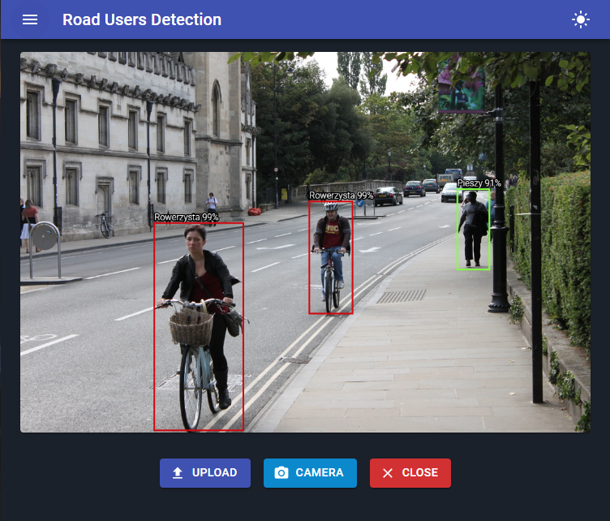
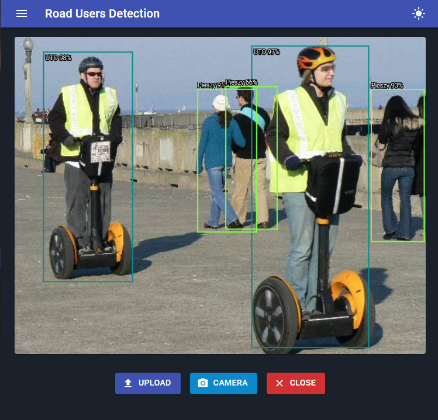

# Road Users Detection

Add your own tensorflow.js model to react app.

## Installation

Run command `npm install`.

Move your tensorflow.js model to `public/tensorflow/`.

Add model configuration in `src/config/models.ts`.

Set labels and colors.

Set threshold and configure indices.

Choose active model.

## Preview

Images from Open Image Dataset, [CC BY 4.0](https://creativecommons.org/licenses/by/4.0/)

